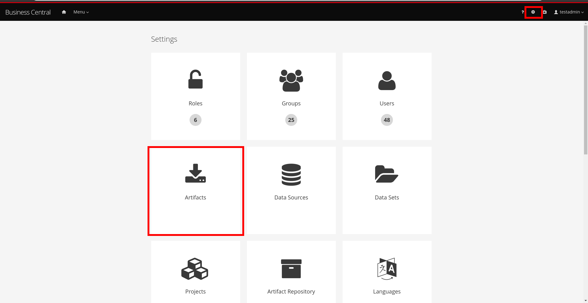
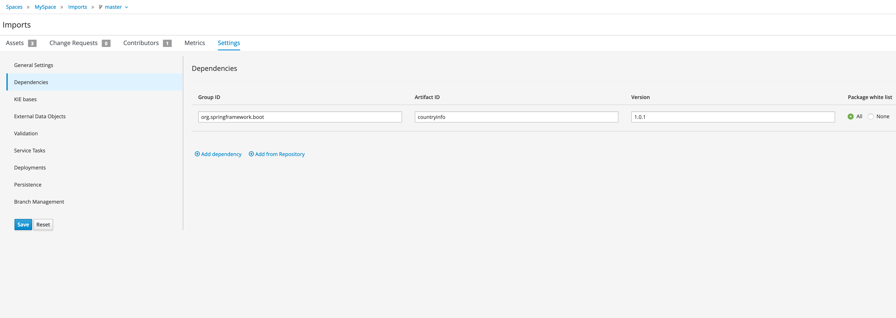

Imports property of a process in Business Central
=================================================

>## Important Note
>To test this Project you should have WebService provided by https://github.com/bpmn-tutorials/countryinfo.
>Just compile and run it, all of the rest info is just for the info.

>### Important Note 2
>Do not forget to add as dependency Java types by adding Jar from the repo above from https://github.com/bpmn-tutorials/countryinfo/tree/master/countryinfo_datatypes
>Build *.jar file from directory above and import it as artifact to the business central:
>
>After that add artifact as dependency to your project
>

This project is used to test Imports property of the Process using WebService Service Task to call remote Web service.

# ImportsTest.bpmn


Process gets String country names, and make request to the WebService to ask addition information about those countries. Before start you need to configure Imports properties section of the process like this:
### Data Type Imports
* *org.countryinfo.springsoap.gen.Country*
* *org.countryinfo.springsoap.gen.GetCountryRequest*
* *org.countryinfo.springsoap.gen.GetCountryResponse*
* *java.util.ArrayList*
### WSDL Imports
* **Location** - *http://localhost:8082/ws/countries.wsdl*
* **Namespace** - *http://countryinfo.org/springsoap/gen*

## Initialization Script Task
Initialization Script Tasks transforms `Strings` from input to `GetCountryRequest` objects which will be provided for CountryInfo Web Service

## Service Task
Make call to the Web Service for each country name given during process start and store answers from the Web Server in Process variable `outputCountries`
Service Tasks used parameters
* **Implementation** - *WebService* (WebService will be called)
* **Interface** - *CountriesPortService* Name of the service to call
* **Operation** - *getCountry* operations which should be executed on the Web Service
* **Multiple Instance** - *true* (Task will be executed as many times as many names will be provided in Process Variable _inputCountryNames_)
* **MI Collection input** - *inputCountryNames* (Array list prepared in **Initialization** task using data provided during process start)
* **MI Data Input** - *Parameter* this is Input Data Assignment for WebService Service task, it will be transferred to Web Service
* **MI Collection output** - *outputCountries* (Array list where values returned from Web Service Task will be stored)
* **MI Data Output** - *Result* this is Output Data Assignment for WebService Service Task, when class executed on the server this variable will store the result

## Task Script Task
Will print to the server log values returned by WebServer.

For example if you start the process with following countries (only the supported by the WebService): **Spain, Poland, United Kingdom, United States** you will see data about those countries printed to the server log:
```
16:09:22,714 INFO  [org.jbpm.process.workitem.bpmn2.ServiceTaskHandler] (default task-19) WS Client is created for {http://countryinfo.org/springsoap/gen}CountriesPortService
16:09:22,900 INFO  [stdout] (default task-19) Name: Spain
16:09:22,901 INFO  [stdout] (default task-19) Population: 46704314
16:09:22,901 INFO  [stdout] (default task-19) Capital: Madrid
16:09:22,901 INFO  [stdout] (default task-19) Currency: EUR
16:09:22,901 INFO  [stdout] (default task-19) Name: Poland
16:09:22,901 INFO  [stdout] (default task-19) Population: 38186860
16:09:22,901 INFO  [stdout] (default task-19) Capital: Warsaw
16:09:22,901 INFO  [stdout] (default task-19) Currency: PLN
16:09:22,901 INFO  [stdout] (default task-19) Name: United Kingdom
16:09:22,901 INFO  [stdout] (default task-19) Population: 63705000
16:09:22,902 INFO  [stdout] (default task-19) Capital: London
16:09:22,902 INFO  [stdout] (default task-19) Currency: GBP
16:09:22,902 INFO  [stdout] (default task-19) Name: United States
16:09:22,902 INFO  [stdout] (default task-19) Population: 702455
16:09:22,902 INFO  [stdout] (default task-19) Capital: Washington, D.C.
16:09:22,902 INFO  [stdout] (default task-19) Currency: USD
```
